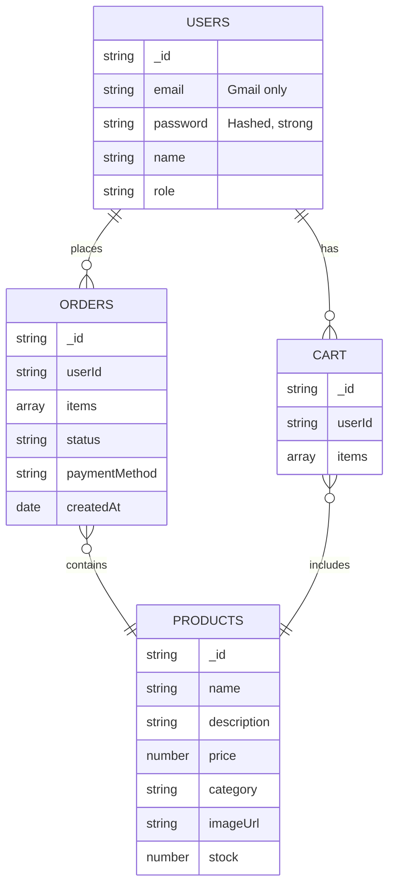

## Database Schema (MongoDB Collections)

```mermaid
erDiagram
  USERS {
    string _id
    string email "Gmail only"
    string password "Hashed, strong"
    string name
    string role
  }

  PRODUCTS {
    string _id
    string name
    string description
    number price
    string category
    string imageUrl
    number stock
  }

  CART {
    string _id
    string userId
    array items
  }

  ORDERS {
    string _id
    string userId
    array items
    string status
    string paymentMethod
    date createdAt
  }

  USERS ||--o{ CART : has
  USERS ||--o{ ORDERS : places
  ORDERS }o--|| PRODUCTS : contains
  CART }o--|| PRODUCTS : includes

```

