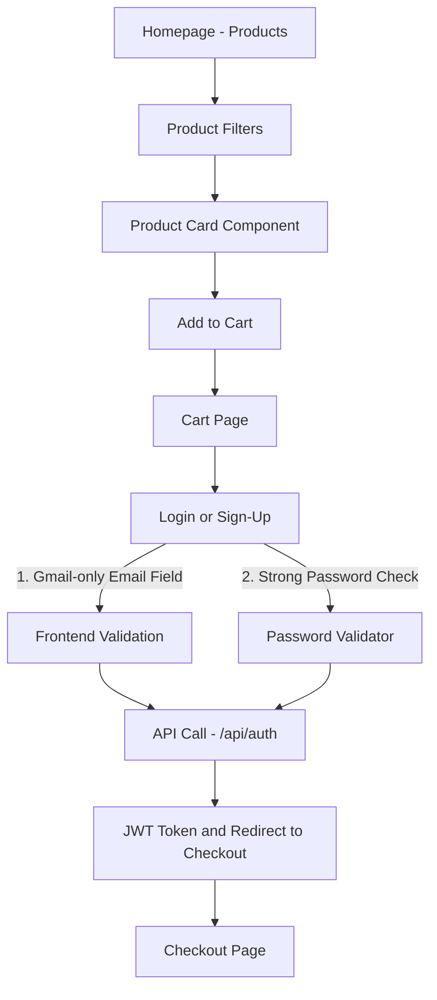

## Frontend Logic Flow

The frontend uses reusable components, enforces password and email validation (blocking weak passwords and non-Gmail addresses), and implements conditional routing based on login status and cart state before calling the backend authentication API.
