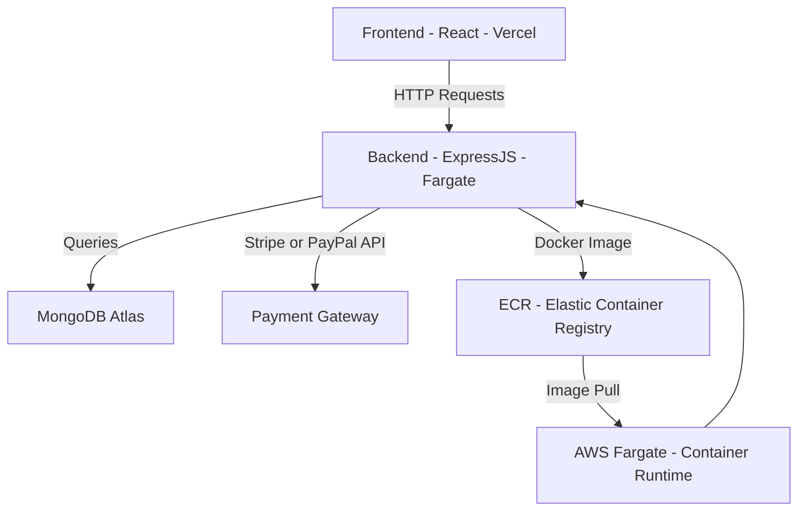

## System Architecture Diagram (High Level)

```mermaid
graph TD
  A[Frontend - React - Vercel] -->|HTTP Requests| B[Backend - ExpressJS - Fargate]
  B -->|Queries| C[MongoDB Atlas]
  B -->|Stripe or PayPal API| D[Payment Gateway]
  B -->|Docker Image| E[ECR - Elastic Container Registry]
  E -->|Image Pull| F[AWS Fargate - Container Runtime]
  F --> B
```
